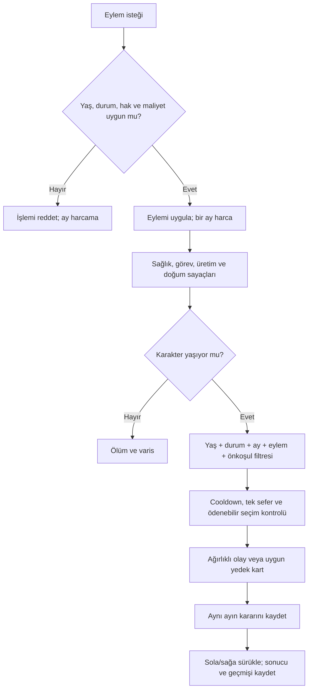

# APK sistem haritası ve YAZGI uyarlaması

İnceleme tarihi: 1 Ekim 2026. Başlangıç repo sürümü: `49302ff`. Mevcut `index.html` ve README bütünüyle incelendi; dönemler, takvim, kariyerler, olay zincirleri, aile, soy, varlıklar ve mevcut kayıt anahtarı temel alındı.

Bu çalışma referanslardan **oyun mimarisi, veri ilişkileri ve koşul türleri** çıkarır. Referans uygulamaların kodu, hikâyeleri, arayüzü, görselleri, sesleri veya paketleri YAZGI’ya eklenmedi. Eklerdeki sınıf/alan adları, meslek tanımları ve sayısal koşullar analiz kanıtıdır; oyun bu dosyaları yüklemez.

## Kanıt düzeyi ve sınırlar

- **Veriden doğrulandı:** çözümlenmiş bir tabloda bulunan sayısal değer veya alan.
- **Yapıdan doğrulandı:** metadata, Dart paket yolu, serileştirme sembolü veya bundle nesne türü. Sistemin varlığını gösterir; tek başına çalışma zamanındaki bütün koşulları göstermez.
- **YAZGI tasarımı:** tarihsel ortam için burada belirlenen oyun kuralı. Referansın yaşı veya tarihsel bir yasa olduğu iddia edilmez.
- **Bilinmiyor:** native fonksiyon gövdesine, sunucuya veya çalışma zamanı doğrulamasına ihtiyaç duyan koşullar.

İncelenen BitLife dosyasının adı modlu dağıtıma işaret ediyor. Bulgular bu dosyanın içeriğine aittir; resmî sürümün tüm davranışlarına genellenemez. APK’lar çalıştırılmadı. Statik tarama, erişilebilir dosyalar ve modeller için kapsamlıdır; bütün native dalların ve sunucu kurallarının eksiksiz çıkarıldığı iddia edilmez. Özellikle TC Simülasyonu’nun sayısal minimum yaşları AOT sembollerinden elde edilemedi. Bilinmeyen bir yaş “0” veya “serbest” olarak yorumlanmadı.

## Paket ve içerik organizasyonu

| Referans | Doğrulanan mimari | Çıkarılan yapı |
|---|---|---|
| BitLife 3.25.1 dosyası | Unity, ARM64 IL2CPP, metadata sürümü 39 | `libil2cpp.so`, `global-metadata.dat`, Assembly-CSharp izleri; 2.755 `Scenario*` tip adı |
| `data.unity3d` | Unity çalışma zamanı/içerik nesneleri | 7.854 MonoScript, 1.726 MonoBehaviour, 154 Texture2D, 130 Sprite, 418 AudioClip; animasyon, font, video ve Canvas nesneleri |
| `datapack.unity3d` | Paketlenmiş içerik/veri | 1.086 TextAsset, 8.133 Texture2D, 8.094 Sprite, 17 AudioClip; prefab/arayüz nesneleri |
| BitLife tabloları | 967 `-enc` adlı TextAsset; Base64 ve tekrarlı XOR katmanı | En az iki sütun ve bir veri satırı filtresiyle 954 tablo, 84.555 satır. Bunlar ad listeleri ve yardımcı/test verileri de içerir; **olay sayısı değildir** |
| TC Simülasyonu 1.0.134 | APKS içinde base ve mimari/dil/yoğunluk split’leri; Flutter/Dart AOT | `libapp.so`, `libflutter.so`, `flutter_assets`; 638 uygulamaya ait paket yolu |
| TC içeriği | Görsel, ses, font, manifest, lisans/yardımcı veriler | base.apk: 3.261 küçük harfli `.png`, 179 `.jpg`, 116 `.svg`, 85 `.mp3`, 4 `.wav`; diğer uzantılar envanter ekinde |

Sayılar nesne/satır sayısıdır; benzersiz hikâye veya kullanıma açık özellik sayısı değildir. Tek sütunlu listeler, boş TextAsset’ler ve ayrıştırılamayan içerik sıkı tablo sayımına dahil değildir. Dosya SHA-256 özetleri ve tüm nesne sayımları [envanterde](reference-inventory.json).

Yöntem: arşiv ve split envanteri → motor tespiti → Unity TextAsset okuma → veri katmanının çözülmesi → CSV şema ve koşul analizi → metadata type/field eşleştirme → Dart paket yolları ve model/serileştirme izleri. Metadata v39’da tablo başlıkları offset/size/count üçlüleriyle; bu dosyadaki tipler 76, alanlar 10 baytlık kayıtlarla eşleştirildi. Kaynak kod üretimi veya referans UI aktarımı yapılmadı.

## Tam sistem eşleştirmesi

| Sistem | APK’den elde edilen mimari / koşullar | YAZGI karşılığı ve uygulama durumu |
|---|---|---|
| Yaş ve açılma | Min/max yaş; ülke bazlı okul, emeklilik, ehliyet ve diğer eşikler; TC `ActivitiesAgeLimit` ve yaş dönemi sınıfları | Merkezi yaş/koşul kontrolü; 0–4 bakım, 5–9 gözetimli çocukluk, 10–17 yetişme, 18+ yetişkin sorumlulukları. Uygulandı |
| Zaman | Yaş/yıl geçişleri, senaryo kuyrukları ve kayıt geçmişi | Her yaşta 12 eylem. Bir eylem bir ay; ardından aynı ayda bir bağlamsal kart. Kart çözülmeden yeni eylem/yaş geçişi yok. Uygulandı |
| Stat ve beceriler | Sağlık, mutluluk, zekâ, görünüş, disiplin, karma, irade, atletizm, şöhret, doğurganlık gibi alanlar | Sağlık, dirlik, genel beceri, itibar + binicilik, okçuluk, savaş, zanaat, bitig, söz, ticaret. İlgili statlar korunup uzmanlık/tecrübe kapıları güçlendirildi |
| Ana meslekler | 168 satır: yaş, eğitim, bölüm, çalışma yılı, sağlık/zekâ/görünüş/karma, sicil, lisans, araç ve diğer koşullar | Çoban, avcı, at bakıcısı, demirci çırağı/demirci, ozan, tüccar, kervan rehberi, bitigçi, elçi, alp, akıncı, tarkan, bey. 14 yol korundu; koşulları merkezileştirildi |
| Yarı zamanlı işler | 82 satır: 13/14/15/16/18/21/25/50 yaş eşikleri; öğrenci, saat, yorgunluk, stat koşulları | Çocuklukta aile işine yardım ve gözetimli çıraklık; yetişkinlikte görevde çalışma ve mal yönetimi. Modern saatlik ücret sistemi aktarılmadı |
| Eğitim | Okul kademeleri, ülkeye bağlı başlangıç/mezuniyet, not/başarı; 115 okul etkinliği; stat ve seçme koşulları | Aileden öğrenme, usta yanında yetişme, at/ok/güreş talimi, söz/destan ve bitig öğrenimi. Üniversite/diploma evrenselleştirilmedi |
| Kariyer/terfi | Kıdem hattı, gerekli çalışma yılları, atlanabilen pozisyon, başarı niteliği; 19 askerî rütbe satırı | Uzmanlık + birikmiş ay tecrübesi + itibar + sefer sayısı. İşe giriş ve olayla terfi aynı kontrolü kullanır. Görev başvurusu hâlâ başarı garantisi değildir |
| Olay motoru | Scenario sınıfları, tematik veri tabloları, yaş/stat/aile/durum koşulları; TC AgeEvent/EventCreator | Ağırlık, min/max yaş, ay/mevsim, son eylem türü, flag, mülk, aile, sefer, sürgün, tutsaklık; cooldown/once; uygun maliyetli seçenek şartı. Uygulandı |
| Olay zincirleri | Eğitim, ilişki, meslek, ceza, sağlık ve özel kariyer senaryoları | Mevcut demircilik, bitig/elçilik, kervan, sefer, husumet, ocak, sürü ve sürgün zincirleri korundu; yaş ve uzmanlık açıkları kapatıldı |
| Arkadaş/rakip | NPC ilişki nitelikleri ve geçmişi; Friend/CoWorkers/Devrem modelleri | Yaşıt dostlar, rakipler, armağan, vakit geçirme, büyükten öğüt, uzlaşma; gerçek NPC ilişki puanları. Uygulandı |
| Sevgili/evlilik | Lover/Wife modelleri, ilişki ve evlenme senaryoları; 80 teklif ortamı satırı, bazılarında 18 yaş | 16+ yaşıt eş adayıyla aile aracılı tanışma; iki taraf da 18+ ve ilişki ≥65 ile ocak kurma. Bebek/çocuk evlilik seçmez |
| Çocuk | Children, fertility, aile modelleri; çocuk sağlığı/eğitimi senaryoları | İki yaşayan yetişkin, evlilik, yeterli sağlık, uygun yaş ve özgürlük koşulları; 9 aylık gebelik sayacı; doğum ayı; gerçek çocuk hedefli bakım/yetişme kartları. Uygulandı |
| Askerlik | Enlisted/officer rütbeleri, hizmet yılı ve stat koşulları; TC Askerlik/Devrem | Boy/kağanlık sefer çağrısı, katıl/reddet kartı, 4–8 aylık görev, talim, yoldaş, yara, ganimet ve tutsaklık. Çağrı kayıtta korunur; 18+ |
| Sağlık/hastalık | 107 insan hastalığı satırı: min/max yaş, belirtiler, doğal bulaşma/iyileşme, tedavi, ölümcüllük ve tedavisizlik alanları | Otacı, dinlenme, ateşli rahatsızlık, soğuk, yara ve yaşlılıkta eklem sıkıntısı için özgün basit model. 107 modern hastalık bire bir eklenmedi; gerçek tıp simülasyonu iddiası yok |
| Suç/ceza | 138 yetişkin ve 86 çocuk cezaevi suç kaydı; prison/juvenile senaryoları ve sicil | Töre ihlali, tazminat, itibar kaybı, sürgün, tutsaklık, fidye/kaçış. Oyuncunun suç eylemleri 18+. Modern hapishane ve çocuklara yetişkin suç menüsü aktarılmadı |
| Para/geçim | Maaş, gelir/gider, portföy, borç ve çeşitli mülk modelleri | Mevsim ve kıtlığa göre değişen pazar baskısı; üç aylık hane geçimi ve varlık bakımı; meslek gelirinde talep etkisi. Servet negatife düşmez, ödeme yetmezse geçim sıkıntısı sağlık/dirlik ve varlık durumuna yansır. Modern banka/borsa sistemi yok |
| Araç/mülk | Araç, gayrimenkul ve eşya sahipliği; lisans ve araç gereksinimleri | At, yay, kılıç, zırh, sürü, yurt, kervan payı, demir ocağı; alım ve takas. At/yay 12, diğerleri 18+ |
| Yatırım/işletme | Şirket, personel, üretim, satış, yatırım riskleri; TC Girisimci/KoyeDonus | Sürü, demir ocağı ve kervan payı artık durum/bakım, talep, zarar ihtimali, aktif yönetim ve değişken satış fiyatına sahip. Pasif gelir garanti değildir. Modern şirket/hisse/kripto arayüzü yok |
| Aktiviteler | Sosyal, kültürel, spor, okul ve meslek etkinlikleri | Ozan dinleme, toy, güreş, at yarışı, bakım, sürü yardımı, takas/pazar, kurultayı dinleme ve beyin otağı. Her birinin açık yaş eşiği var |
| NPC yaşamı | Person, Mother/Father, Friend, Lover/Wife, Children/Sibling, CoWorkers/Prisoners; yaş/stat/ilişki modelleri | NPC kimliği, yaş, sağlık, ilişki, meslek, eş, çocuk/torun ve ölüm; yoldaşlar dahil. Yetişkin NPC aile kurar. Soy devamında gerçek aile bağlantıları korunur |
| Yaşlılık/ölüm | Yaş ve sağlık riski, emeklilik eşikleri, atalar ve ölüm verileri | 50+ tecrübe çağı, 65+ yaşlılık; kırılganlık ve kalıcı yaralar ölüm riskine eklenir. Ölüm nedeni kayıt altına alınır; sağlık sıfırsa ay içinde ölüm |
| Miras/soy | Will, inheritance, ancestors ve legacy modelleri | 55+ aile meclisinde vasiyet hazırlığı, eşit paylaşım veya ana varis, 60+ son dilek; ölümde servet/varlık dağılımı ve ölüm nedeni kaydı. Çocukla aynı takvim yılı ve kalan aylarla devam edilir; tercihli miras kardeş güveni/kinini ve sonraki yıllardaki miras olayını etkiler. Bu paylaşım bir oyun kuralıdır |
| Achievement/unlock | AchievementManager, açılma/ödül ve oyuncu ilerleme alanları | Yaş, sefer, özgürlük, ocak, çocuk, varis, servet, ustalık, uzlaşma, beylik ve yaşlılık. Mevcut başarımlar korundu; ustalık/uzlaşma eklendi |
| Kayıt/veri modeli | BitLife Life/SimPerson/SaveSlot/SaveGameManager; TC JSON serileştirme, saveLocalDB/Hive izleri | Sürümlü LocalStorage kaydı; pending karar + ay + hedef NPC + seçim sayfası; göç öncesi yedek; bozuk kayıt üzerine yazmama. APK’nin dosya biçimi kullanılmadı |
| İçerik/asset ayrımı | Bundle/Resource, TextAsset, texture/sprite, ses, prefab, font; Flutter assets klasörleri | YAZGI’nın kendi HTML/CSS/metin/verileri korunur; kurallar `systems.js` içinde; analitik ekler `docs/` altında. Referans asset yok |

## TC Simülasyonu özel kariyerleri

Bu yollar AOT paket isimleriyle doğrulandı; aşağıdaki yaşlar TC’den çıkarılmış sayılar değildir. Aşağıdaki eşleştirmeler sistem tasarımıdır; her özel kariyer ayrı bir minioyun olarak uygulanmış değildir.

| Paket alanı | Tarihsel uyarlama kararı |
|---|---|
| Askerlik | Boy seferi ve birlik/yoldaş döngüsü |
| Girisimci, KoyeDonus | Sürü, demir ocağı, kervan ortaklığı |
| ArabaYarisi | Binicilik ve toyda at yarışı |
| DonerUstasi, Pizzaci, SuperMarket | Modern işletmeleri taşımak yerine toy için yiyecek hazırlama, erzak ve takas; ayrı meslek/minioyun henüz yok |
| GuzellikMerkezi | Temel saç/bakım etkinliği; modern salon yok |
| Influencer | Söz/itibar ve ozan aracılığıyla ün; sosyal medya yok |
| Mafya, Mafya2 | Töre dışı kazanç, husumet, yağma ve karşılıkları; modern suç örgütü hiyerarşisi yok |
| Muzisyen, Ressam | Ozanlık ve zanaat/süsleme; modern kayıt şirketi/galeri yok |
| Politika | Boy itibarı, elçilik, kurultay ve beylik; modern seçim/parti sistemi yok |
| PasaportPolisi, TrafikPolisi | Yol/geçit gözcülüğü kavramsal karşılık; pasaport ve trafik polisi mesleği yok |
| PetPaketi | At/hayvan bakımı; tüm modern evcil hayvan türleri aktarılmadı |
| Spor | Güreş, binicilik, okçuluk |
| Tatil | Dinlenme ve ziyaret; modern turizm/paket tatil yok |
| AaCommons | Ortak özel-kariyer altyapısı; ayrı bir oynanış alanı değil |

Uzay, çağdaş istihbarat teknolojileri, kumarhane işletmesi, modern şirketler, uçaklar, vampir/zombi gibi fantastik paketlerin zorlanmış tarihsel kopyası yapılmadı. Kimlik olarak karşılığı bulunmayan meslekler eklenmez; taşıma, öğretme, tedavi etme gibi işlevler gerektiğinde döneme uygun özgün sistemde değerlendirilir. Bir modern doktor uzmanlığını doğrudan “otacı” saymak, aynı teknik kapasiteyi var saymak anlamına gelmez.

## YAZGI yaş ve erişim sözleşmesi

Bu eşikler **oyun tasarımıdır**. Bütün İslamiyet öncesi Türk topluluklarında geçerli tek bir yetişkinlik, evlilik, eğitim veya askerlik yaşı olduğu ileri sürülmez. Ciddi oyuncu kararları için bu sürüm 18 yaş eşiği kullanır.

| Minimum yaş | Açılan eylem | Ek koşul / kapsam |
|---:|---|---|
| 0 | Aile bakımında ay geçirme, bakım kartları | 0–4 seçim aktörü aile/bakıcıdır; iş, yatırım, evlilik, suç ve sefer yok |
| 5 | Gözetimli at binme, yakınla vakit, dinlenme, aileyle otacı | Otacı 2 servet; çocuk tek başına büyük karar almaz |
| 6 | Dost edinme, büyüğe danışma, toya katılma, ozan/güreş izleme | Öğüt alınan kişi en az 16 ve oyuncudan büyük |
| 7 | Gözetimli okçuluk | Çocuğa uygun talim; savaş görevi değil |
| 8 | Güreş talimi, söz/destan, at bakımı | Gözetimli yetişme |
| 10 | Sürüye yardım, temel zanaat öğrenimi, armağan, yaşıt rekabeti | Çoban yardımı için ayrıca beceri; armağan 3 servet |
| 12 | Gözetimli av/bakım/çıraklık, bitig, at yarışı, pazar, at/yay | Bağımsız yetişkin işletmesi veya sefer değil; kaçış yalnız tutsaksa |
| 15 | Kervan pazarını gezme | Ticaret öğrenme; kervana sermaye koyma değil |
| 16 | Kurultayı dinleme, yaşıt eş adayıyla tanışma, ozanlık adayı | Oy verme/yönetme veya evlenme değil; ozanlık için beceri ve tecrübe gerekir |
| 18 | Evlilik, çocuk, sefer, töre dışı eylem, mülk/sermaye, mal paylaşımı | Sağlık, ilişki, mülk, meslek ve tecrübe kapıları ayrıca geçerli |
| 22 | Elçi | Bitig/söz ve devlet tecrübesi |
| 24 | Tarkan | Beceri, itibar, tecrübe ve 3 sefer |
| 28 | Boy beyi | Beceri, itibar ve devlet tecrübesi |
| 50 | Ağır görevi bırakma; yaşlılığa bağlı eklem sıkıntısı olasılığı | Aktif görev varsa bırakılabilir |
| 65 | Yaşlılık başarımı | Hayatta bu yaşa ulaşma |

Tutsaklıkta sivil eylemler kapalıdır. Seferde talim, bakım, bekleme ve birlikten ayrılma dışındaki sivil eylemler kapalıdır. Eylem hakkı bitmişse veya karar bekliyorsa hiçbir eylem tekrar harcanamaz. Bu kurallar yalnızca butonlarda değil bütün eylem işleyicilerinde uygulanır.

### Mesleklerin eksiksiz koşul tablosu

Bütün meslekler ayrıca mevcut genel beceri eşiğine tabidir; `max(0, meslek.skill − 10)` değeri görev kartında gösterilir. Askerî görevler sağlık ≥40 ister; devlet/askerî görevler sürgünde alınamaz. Uzmanlık sayıları 0–100 aralığındadır. Aşağıdaki aylar ilgili alanda tecrübedir; yaşın kendisi tecrübe yerine geçmez.

| Yol | Yaş | Uzmanlık | Tecrübe | Diğer |
|---|---:|---|---|---|
| Çoban | 10 | Binicilik 10 | — | 18 altı gözetimli oba/sürü yardımı |
| Avcı | 12 | Okçuluk 20, binicilik 10 | — | 18 altı gözetimli |
| At bakıcısı | 12 | Binicilik 25 | — | 18 altı gözetimli |
| Demirci çırağı | 12 | Zanaat 17 | — | Usta gözetimi |
| Demirci | 18 | Zanaat 40 | Zanaat 12 ay | — |
| Ozan | 16 | Söz 35 | Kültür 6 ay | — |
| Tüccar | 18 | Ticaret 35 | Ticaret 12 ay | — |
| Kervan rehberi | 18 | Ticaret 30, binicilik 25 | Ticaret 6 ay | — |
| Bitigçi | 18 | Bitig 50 | Devlet 12 ay | — |
| Elçi | 22 | Bitig 55, söz 45 | Devlet 24 ay | — |
| Alp | 18 | Savaş 45, okçuluk 30, binicilik 30 | — | Sağlık 40 |
| Akıncı | 18 | Savaş 50, binicilik 40 | Askerî 6 ay | Sağlık 40 |
| Tarkan | 24 | Savaş 66, söz 40 | Askerî 24 ay | İtibar 35, 3 sefer, sağlık 40 |
| Boy beyi | 28 | Söz 60, bitig 40 | Devlet 36 ay | İtibar 45 |

Demir ocağı alımı ayrıca zanaat 40 ve 12 ay zanaat tecrübesi ister. Referansın 168 mesleğinin ve 82 işinin kendi sayısal koşulları [ayrı ekte](REFERANS-MESLEKLER.md); bunlar YAZGI’ya topluca kopyalanmış meslekler değildir.

## Olay seçiminin koşul sırası

Örnekler: kış darlığı yalnız 10–12. aylarda; kuraklık 4–6. aylarda ve sürü sahipliğinde; yaralanma eylem bağlamında; sefer kartları aktif seferde; ganimet kartı yakın sefer sonucuna bağlı; sürgünden dönüş sürgün ve bağlılık flag’i ister. Çocuk yetiştirme kartı gerçekten yaşayan 7–17 yaş çocuk hedefler. Arkadaş kavgası yaşayan dost gerektirir. Bilinmeyen bir önkoşul otomatik olarak başarılı kabul edilmez.

Her kart iki seçenekle sınırlı olmak zorunda değildir: üç veya daha fazla seçenek varsa sağa sürükleme sonraki alternatifleri açar; son seçim yapılana kadar ay değişmez. Fare, dokunma, ok tuşları ve yön düğmeleri aynı işleyiciyi kullanır. Yeni eylem başlatan popup yok; yeni karakter ve ölüm/varis pencereleri korunur.

## Kayıt ve NPC şeması

| Kayıt bölümü | YAZGI alanları / ilişkileri |
|---|---|
| Kimlik ve zaman | `version`, `id`, ad/cinsiyet/dönem/yer/boy, doğum yılı, yaş, `monthsRemaining` |
| Oyuncu | sağlık, dirlik, genel beceri, itibar, servet, uzmanlıklar |
| İlerleme | görev/yol, `experience`, `careerMonths`, varlıklar, başarımlar |
| Aile | parents, siblings, friends, rivals, partner, children; NPC id, yaş, sağlık, ilişki, alive, eş/descendants |
| Doğum | `pregnancy.remaining`, NPC `birthYear` ve `birthMonth`; doğum günü doğru ayda ilerler |
| Durum | captive, exile, military.active/dutyMonths/campaigns/wounds/comrades, ailments |
| Olay | pendingEventId, pendingEventContext(age/year/month/kind/targetId), decisionOffset, pendingDecision |
| Hafıza | eventHistory, eventCooldowns, eventArchive, flags, timeline, crimeRecord |
| Miras | will, legacy.generation/familyName/past, gerçek ebeveyn ve kardeş ilişkileri |

`yazgi_full_v1` anahtarı korunur; güncel kayıt sürümü 20’dir. Eski kaydın ilk sürüm-6 göçünde `yazgi_before_v20` yedeği alınır. Eski kayıt NPC, varlık, başarı ve olay geçmişlerini korur; eksik yeni alanlar tamamlanır. Yaşı uygun olmayan eski görev `deferredRole`, evlilik `deferredMarriage` olarak ayrılır; partner silinmez. Uygun yaşa gelince oyuncu yeniden karar verir. Bozuk kayıt sessizce yeni oyunla değiştirilmez.

Referans modellerinin alan envanteri [reference-models.json](reference-models.json), TC paket yolları [reference-tc-paths.json](reference-tc-paths.json), bütün çözümlenmiş tablo şemaları ve koşul satırları [reference-conditions.json](reference-conditions.json) içindedir. JSON satır numaraları ilgili tablonun veri satırını belirtir. Boş koşul değeri çalışma zamanında sınırsız erişim kanıtı değildir.

## Tarihsel yaklaşım

Göktürk/Uygur/Batı Türk dünyaları tek ve değişmez bir toplum gibi modellenmemelidir. Göçer hayvancılık, yerleşik merkezler, zanaat ve uzun mesafeli ticaretin birlikte var olması tasarımın dayanağıdır. Dönem/bölgeye göre gelişecek ayrıntılar, tek bir modern mesleğin adını değiştirerek tamamlanmış sayılmaz.

Başvuru çerçevesi: [UNESCO Orkhon Valley Cultural Landscape](https://whc.unesco.org/en/list/1081/), [UNESCO Silk Roads: Chang’an–Tianshan Corridor](https://whc.unesco.org/en/list/1442/), [UNESCO Silk Roads teknik bilgi alışverişi](https://en.unesco.org/silkroad/content/did-you-know-exchange-technical-knowledge-used-craft-silk-roads-goods). Bu kaynaklar oyun içindeki sayısal yaş, hastalık veya miras formüllerini doğrulamaz; onlar açıkça tasarım tercihleridir.

## Uygulama kapsamı ve kalan araştırma

Bu değişiklik, mevcut oynanabilir sistemlerin yaş/zaman/kayıt tutarlılığını güçlendirir ve sağlık, uzmanlık tecrübesi, üretim, NPC ilişkileri ve mal paylaşımı için çalışan temel ekler. Referansların bütün özel kariyer minioyunları, yüzlerce hastalığı veya bütün native senaryoları uygulanmış değildir. TC’nin gerçek sayısal açılma sabitleri ve BitLife’ın tablo dışı native/sunucu kapıları daha ileri doğrulama gerektirir. Bu sınırları “eksiksiz kod çözümü” diye gizlemek yerine eklerde gözlenen veriyi ve tasarım kararını ayrı tutuyoruz.

### Tutsaklık, sürgün ve barınma uyarlaması

Modern yaşam simlerindeki hapishane/evsizlik derinliği isteği YAZGI’ya dönem bağlamında uyarlandı. Hapishane işi yerine tutsak kampında emek ve erzak, telefon/ziyaret yerine yakınlara haber-fidye desteği, evsizlik yerine sürgünde barınak ve erzak güveni kullanılır. Tutsak veya sürgünde tanışılan NPC’ler kalıcı ilişkiye dönüşebilir; önceki bölümden çıkınca geçmiş kaydı saklanır.

### Yaşam çeşitliliği ve tekrar karşıtı döngü

Oyuncunun her yıl aynı birkaç eylemi tekrarlamasını azaltmak için v9 ile kalıcı yaşam çeşitliliği profili eklendi. Her yıl karakterin yaşına ve mevcut durumuna uygun bir yıllık amaç seçilir; farklı faaliyet, eğitim, aile, meslek, ticaret, sağlık, işletme ve mevsim hedefleri arasında dönüşür. İlkbahar, yaz, sonbahar ve kışta görünen mevsimlik faaliyetler farklıdır. Faaliyet geçmişi saklanır; yeni veya seyrek yapılan uğraşlar ek canlılık verirken aynı faaliyetin arka arkaya aşırı tekrarı ek mutluluk sağlamaz ve küçük bir tekrar yorgunluğu yaratır. Bu yapı sadece daha fazla buton eklemek yerine yılların birbirinden farklı akmasını hedefler.

### Göç, yerleşim ve uzaklık

v10 ile karakter artık doğduğu yerde bütün ömrünü geçirmek zorunda değildir. Faaliyetler ekranından mevcut yılda erişilebilir yerleşimlere göç planlanabilir. Aynı siyasi çevrede yer değiştirme ile başka bir siyasi çevreye geçiş ayrılır; başka siyasi çevreye geçişte eski devlet nüfuzu büyük ölçüde kaybolur ancak karakterin boy kimliği korunur. Oyuncu yalnız, eşi ve çocuklarıyla veya ebeveyn/kardeşleri de kapsayan yakın grubuyla gidebilir. Yol maliyeti; mesafe, kişi sayısı ve taşınan varlıklarla artar. Binicilik ve at sahibi olmak yol riskini azaltır; kış yolculuğu riski artırır.

Geride kalan NPC'ler eski yerlerinde yaşamaya devam eder. Uzakta yaşayan yakınlarla etkileşim mümkündür fakat yol masrafı ve küçük bağ aşınması vardır. Yeni yerleşimde yerel kabul ayrı bir değer olarak tutulur; komşularla tanışma, ortak iş ve toy/toplantılara katılma ile artar. Göç geçmişi, nereden nereye gidildiği, kiminle gidildiği, maliyet ve yol sorunu yaşanıp yaşanmadığıyla saklanır.

### Yetişme, usta ve akran çevresi

v11 ile tek tuşla stat artıran eğitim modeli kalıcı yetişme yollarına dönüştürüldü. Atlı yetişme, okçuluk, güreş, demir ocağı, bitig/yazı, söz-destan ve takas-kervan yollarının her biri ayrı ay sayısı ve basamak tutar. 6, 18, 36 ve 60 aylık eşiklerde karakter yeni bir seviyeye çıkar ve ustası tarafından sınanır.

Her yolun gerçek bir usta NPC'si ve beraber yetişilen akranları vardır. Güven, saygı ve ilişki ilerlemesi saklanır; akranlar kalıcı dosta dönüşebilir. Usta ve akranlar artık seçimli hayat olaylarının doğrudan hedefidir. Derin bir yetişme geçmişi ilgili mesleğe kabul şansına küçük bir avantaj verir ancak yaş, beceri, tecrübe, itibar veya sefer gibi temel meslek şartlarını bypass etmez.

### Karakter görünüşü ve yaşlanma

v12 ile profil emojisi katmanlı CSS portresine dönüştürüldü. Oyuncu yüz yapısını, ten tonunu, saç biçimini, temel saç rengini, yetişkin erkek karakterlerde sakal/bıyığı ve uygun başlığı değiştirebilir. Görünüş seçimi eylem hakkı tüketmez; günlük bakım ise bir aylık eylemdir.

Portre yalnız kozmetik değildir. Saç ağarması 35 yaş sonrasında kademeli ilerler; yüksek kırılganlık ve düşük sağlık ağarmayı hızlandırabilir. 45 yaş sonrasında yüz çizgileri aşamalı belirir. Sağlık sistemindeki kalıcı yara izlerinden ilk üçü portrede görünür. Tutsaklık doygunluk/parlaklık değişimiyle yorgun görünüm bırakır. Görünüş bakım değeri zaman içinde azalır, hastalık ve zor koşullar bunu hızlandırır; saç/sakal bakımı değeri yeniden yükseltir. Savaş başlığı gibi bazı seçenekler yaşam durumuna bağlıdır.

### İlişki, evlilik ve eski eş geçmişi

v13 ile romantik ilişki tek ilişki çubuğundan ayrı bir yaşam sistemine dönüştürüldü. Her mevcut ilişki için uyum, ahenk, bağlılık, aile onayı, gerilim, kıskançlık, birlikte geçirilen ay, ortak çalışma, tartışma/barışma sayısı ve önemli ortak anılar saklanır. Evlilik kabul olasılığı artık yalnız ilişki puanına değil; güven, bağlılık, ahenk, aile onayı, uyum ve gerilime de bağlıdır.

Oyuncu eş/eş adayıyla vakit geçirebilir, ortak geleceği konuşabilir, ailelerle görüşebilir, birlikte iş yapabilir, gerilimi çözebilir ve kıskançlık/kuşku durumunda güven verebilir. Ailelerle görüşmek partner ile ebeveyn/kardeşler arasında gerçek sosyal bağlantılar oluşturur. Uzak yaşamak ve uzun süre ilişkiye zaman ayırmamak gerilimi şeffaf biçimde artırır; yakın arkadaşlarla yoğun etkileşim kuşkucu partnerlerde kıskançlığı yükseltebilir.

Ayrılıkta NPC silinmez. Eski eş/eş adayı ayrı listede kalır, ilişkinin kapanış nedeni ve eski profil arşivlenir. Oyuncunun mevcut ilişkisi yoksa eski partnerle yeniden görüşme denenebilir. Aile onayı, kıskançlık, ev içi gerilim ve ortak gelecek artık seçimli hayat olaylarına da bağlanmıştır.

### Töre, mağdur, tanık ve kalıcı suç sonuçları

v14 ile suç/töre sistemi tek seferlik rastgele ceza modelinden kalıcı vaka sistemine dönüştürüldü. Her töre dışı eylem ayrı vaka oluşturur; vakada suç türü, mağdur NPC, varsa tanık NPC'leri, olayın ağırlığı, iz/dayanak düzeyi, kazanım, durum ve tazminat bilgisi saklanır. Mağdur ve tanıklar kalıcı NPC havuzuna katılır; ciddi olaylarda mağdur veya yakını hasım olarak yaşamda kalabilir.

Karakter için toplam şüphe ve kötü şöhret değerleri vardır. Eylem hemen açığa çıkmasa bile yeterli iz ya da tanık varsa aynı vaka 1-4 yıl sonra yeniden gündeme gelebilir. Eski vaka doğru mağdur ve tanık kimliğine bağlı kalır. Ciddi mağduriyet aile husumeti oluşturabilir; bu husumet 2-6 yıl sonra mağdur yakınıyla yeniden dönen seçimli olaya dönüşebilir.

Açık töre çağrısında yeni suçlar zincirlenemez. Oyuncu arabulucu arayabilir, uzlaşılan tazminatı ödeyebilir veya töre meclisinin kararına çıkabilir. Sonuçta izler, tanık sayısı, mevcut şüphe, hitabet ve itibar birlikte değerlendirilir. Hafif vakalar tazminat borcuna, ağır ve karşılanamayan yükümlülükler ise sürgün veya tutsaklığa dönüşebilir. Tazminat ve barış girişimleri mağdurun kinini ve aile husumetini gerçekten azaltır.

### Hane, yurt ve barınma düzeni

v15 ile karakterin nerede yaşadığı artık açık bir oyun durumudur. Çocukluk ve gençlikte ana-baba ocağı varsayılan barınma düzenidir. Yetişkin karakter Büyük Yurt edindikten sonra ayrı ocak kurabilir; eş ve yaşayan çocuklar aynı haneye taşınır. Ebeveynlerin ölümü sonrasında mevcut aile yurdu aileden kalan yurt olarak devam edebilir. Geçici barınmaya düşen karakter, aynı bölgede ilişkisi ve güveni yeterli bir ebeveyn, kardeş, akraba veya dosttan yanında kalmayı isteyebilir.

Her barınma düzeninin kapasitesi, rahatlığı ve durumu vardır. Aynı yurtta yaşayan gerçek NPC sayısı kapasiteyi aşarsa mutluluk düşer; ciddi kalabalık sağlık üzerinde de baskı oluşturur. Kendi veya aileden kalan yurt üç kez genişletilebilir ve her genişletme kapasiteyi iki kişi artırır. Yurt işleriyle ilgilenmek barınak durumunu, rahatlığı ve aynı hanedeki kişilerin saygısını iyileştirir.

Yetişkin yaşta ana-baba ocağında kalmaya devam etmek otomatik olarak yasak değildir. Ancak yaş, evlilik, çocuk sayısı, işsizlik, kalabalık ve ebeveyn ilişkisi birlikte ayrı ocak baskısını yükseltir. Baskı çok yükselir ve aile ilişkisi kötüyse karakter geçici barınmaya düşebilir. Geçici barınma özellikle kışın doğrudan sağlık ve mutluluk kaybına, soğuk rahatsızlığı riskine yol açar.

Göç sistemi de hane sistemine bağlandı. Yurt sahibi olarak göç edildiğinde bağımsız yurt düzeni korunabilir; yurt olmadan yeni bölgeye yalnız veya kendi ocağınla gidildiğinde önce geçici barınma gerekir. Yaşanmakta olan Büyük Yurt başka barınma düzenine geçilmeden satılamaz. Hane biçimi ayrıca çeyreklik geçim maliyetini etkiler: aile ocağında veya bir yakının yanında kalmak kendi yurdunu tamamen geçindirmekten daha düşük doğrudan maliyet getirir.

### Yaşayan geniş aile ve kayın akrabalık

v16 ile geniş aile soy ağacında görünen statik yan dallar olmaktan çıkarıldı. Mevcut dede/nine, amca-dayı/hala-teyze ve kuzen kollarına oyuncunun kardeşlerinden doğan yeğenler, çocuklarından gelen torunlar ve daha sonraki kuşaklar oyuncuya göre dinamik akrabalık rolüyle bağlanır. Aile kartı artık NPC'nin eski veri etiketini değil, mevcut oyuncuya göre gerçek akrabalık rolünü gösterir.

Yeni eş adayı oluştuğunda onun ailesi de yaratılır: kayın ana, kayın ata ve varsa eşin kardeşleri kalıcı NPC'lerdir. Bu kişiler kendi kariyer, eş, çocuk, sağlık, ölüm, sosyal bağ ve hafıza sistemlerine katılır. İlişki biterse eski kayın aile geçmişten silinmez. Oyuncu çocuğuyla devam ettiğinde önceki karakterin eşinin anne-babası yeni karakter açısından dede/nine; eşin kardeşleri ise ebeveynin cinsiyetine göre amca-hala veya dayı-teyze olarak kan akrabalığına dönüştürülür.

Aynı bölgede yaşayan aile üyeleriyle büyük aile buluşması yapılabilir. Buluşma oyuncu-NPC bağlarının yanında bazı NPC-NPC akrabalık bağlarını da güçlendirir ve eski kinleri azaltabilir. Geniş aile üyelerine maddi destek verilebilir; güveni ve ilişkisi yüksek, serveti olan yakınlardan yardım istenebilir. İlişkisi yüksek ve varlıklı bazı yaşlı akrabalardan ölüm sonrası küçük aile payları kalabilir.

Uzun legacy kayıtlarının kontrolsüz biçimde binlerce NPC üretmemesi için yaşayan aile dallarının otomatik evlilik/çocuk üretiminde üst sınır vardır. Bu sınır mevcut akrabaları silmez; yalnızca aile ağının yeni dallar üretmesini durdurarak performansı korur. Kayın aile ve kuzenler ayrıca seçimli aile olaylarının doğrudan hedefi olabilir.

### Ebeveynlik ve çocuk yetiştirme

v17 ile çocuklar doğduktan sonra yalnızca yaşlanan normal NPC'ler olmaktan çıkarıldı. Her yaşayan çocuk için ayrı yetiştirme profili tutulur: sıcaklık, disiplin, özgürlük, beklenti, ilgi, iyi oluş, ihmal süresi, kardeş rekabeti, seçilen yetişme yolu ve ebeveynlik geçmişi. Aynı oyuncu farklı çocuklarına farklı davranabilir; sistem bunu çocuk bazında saklar.

Oyuncu bir çocuğun bakımına özel zaman ayırabilir, ona bir şey öğretebilir, fikrini dinleyebilir, sınır koyabilir, kardeşleriyle arasındaki gerilimi çözebilir veya at-savaş, zanaat, bitig-söz, ticaret, ocak/oba ya da serbest gelişim yollarından birine yönlendirebilir. Bakım ve dinleme güven/sıcaklığı yükseltirken, yüksek disiplin düşük sıcaklıkla birleşirse korku, kırgınlık ve düşük iyi oluş üretebilir. Uzun süre zaman ayrılmayan çocuklarda ilgi ve iyi oluş düşer; çok uzun ihmal ebeveyn-çocuk güvenini de aşındırır.

5, 8, 12, 16 ve 18 yaş dönümlerinde o zamana kadar biriken ebeveynlik tarzı çocuğa kalıcı biçimde işlenir. Sıcak bakım merhamet/güven, dengeli disiplin çalışkanlık, sert disiplin temkin/korku, yüksek özgürlük konuşkanlık ve bağımsızlık, yüksek beklenti hırs gibi kişilik sonuçlarına katkı sağlar. Yetişme yolu ilgili becerileri ve amacı etkiler; 18 yaşta çocuk NPC kariyerini bu birikimle seçer. Eski “at-ok / usta / kendi yolu” karar kartı da aynı profile bağlandı ve artık ayrı, çelişen bir sistem değildir.

Kardeşler arasında ilgi farkı büyürse rekabet değeri artabilir ve gerçek NPC-NPC kardeş bağını bozabilir. Ebeveyn arabuluculuk yaparak iki çocuğun da rekabetini ve sosyal husumetini azaltabilir. Çocuğun yalan söylemesi, kendi istediği yolu savunması ve kardeş çatışması gibi seçimli olaylar da doğrudan ebeveynlik profiline işler.

Eski kayıtlar göç sırasında mevcut çocuklar için otomatik yetiştirme profili üretir ve mümkünse ebeveyn kimliklerini bağlar. Böylece v16 kayıtlar çocuk sistemi kaybolmadan v17'ye taşınır.

### Yetimlik, akraba himayesi ve koruyuculuk

v18 ile çocuk yaşta ebeveyn kaybı ayrı bir yaşam durumudur. 18 yaşından küçük oyuncunun yaşayan ebeveyni kalmadığında sistem önce yetişkin kardeş, dede/nine, amca-dayı/hala-teyze ve güvenilir aile dostları arasından ilişki, güven, sağlık, servet, kişilik ve coğrafi yakınlığa göre uygun koruyucuyu seçer. Uygun yakın bulunamazsa oba içinden kalıcı bir Oba Koruyucusu NPC oluşturulur; bu kişi sosyal ağda aile dostu olarak yaşamaya devam eder.

Koruyuculuk profilinde bakım kalitesi, hane istikrarı, kaç ay himayede kalındığı, kaç kez koruyucu değiştiği, birlikte kalan ve başka himaye ocaklarına ayrılan küçük kardeşler ile bütün geçişlerin geçmişi saklanır. Koruyucunun hane kapasitesi elverdiği ölçüde küçük kardeşler oyuncuyla aynı yurtta tutulur; kapasite yetmezse kalan kardeşler başka uygun yakınlara yerleştirilir. Ayrı yaşayan kardeşlerin ilişki ve güveni zamanla aşınabilir, oyuncu onları ziyaret ederek bu bağı güçlendirebilir.

Himaye ocağında oyuncu koruyucusuyla vakit geçirebilir, yurt işlerine yardım edebilir, ondan bir beceri öğrenebilir ve ölen anne/atası hakkında konuşabilir. İlişki sistemi ve koruyucunun özellikleri bakım kalitesini belirler. Yüksek kaliteli bakım çocuk oyuncunun sağlık ve mutluluğunu destekleyebilir; düşük kalite ve istikrarsızlık mutluluğu, uzun süre devam ederse sağlığı da olumsuz etkileyebilir. Koruyucu ölürse sistem geçmişi silmeden bir sonraki uygun yetişkin yakını arar.

Aynı koruyucu yanında başka himaye çocukları da bulunabilir; bunlar kalıcı Himaye Yoldaşı NPC'leridir. Himaye anıları, koruyucu hanedeki gerilim ve ayrı yaşayan kardeşle mesafe seçimli olaylara bağlanmıştır. Oyuncu 18 yaşına ulaştığında aktif koruyuculuk otomatik biter; eski koruyucu ve himaye döneminin bütün hafızası sosyal ağda kalır.

### Dostluk, sırdaşlık ve sosyal çevre

v19 ile dostlar yalnızca tek ilişki çubuğuna sahip NPC'ler olmaktan çıkarıldı. Her dost için tanışma yaşı/yılı, çocukluk dostu olup olmadığı, birlikte geçirilen aylar, ortak deneyim sayısı, paylaşılan sırlar, verilen/alınan destek, son temas, uzaklaşma süresi ve yeniden bağ kurma geçmişi saklanır. İlişki ve güven yeterince yükseldiğinde dost yakın dosta; oyuncunun açık seçimiyle sırdaşa dönüşebilir. Uzun süre görüşülmeyen veya uzak bölgede yaşayan dostlar silinmez, “uzaklaşmış dost” durumuna geçer ve yıllar sonra yeniden görüşülebilir.

Üç veya daha fazla güçlü dost bir arkadaş çevresi oluşturabilir. Çevrenin uyumu, gerilimi, buluşma sayısı ve ortak geçmişi saklanır. Grup buluşmaları sadece oyuncu-dost ilişkilerini değil, grup üyelerinin birbirleriyle gerçek NPC-NPC sosyal bağlarını da güçlendirir. Grup içinde husumet birikirse gerilim yükselir; oyuncu arabuluculuk yapabilir. Dost çevresi çatışmaları seçimli hayat olaylarına bağlanmıştır.

Dostların hayat yolları oyuncuya somut kapılar açabilir. Bir meslekte çalışan dost, kendi görev çevresinde iki yıl geçerli küçük bir kabul avantajı sağlayabilir; bu avantaj hiçbir temel yaş/beceri/tecrübe şartını atlamaz. Uygun yaşta ve mevcut eş adayı yokken dosttan güvenilir biriyle tanıştırmasını istemek mümkündür; yeni eş adayı kimin aracılığıyla tanışıldığını kalıcı olarak hatırlar. Alp/Akıncı/Tarkan olan yetişkin bir dost sefer yoldaşı havuzuna aynı NPC kimliğiyle eklenebilir.

Arkadaşlıklar dünya akışıyla değişir. Dost NPC'ler zaman zaman başka yerleşimlere taşınabilir; coğrafi mesafe ve uzun süre iletişimsizlik bağın yavaşça soğumasına yol açar. Çocukluk dostlarının yıllar sonra geri dönmesi, meslek kapısı önermesi ve arkadaş çevresindeki gerilim gibi yeni seçimli olaylar eklenmiştir.

### Görev çevresi, iş ilişkileri ve kıdem

v20 ile aktif bir mesleğe girildiğinde o göreve özel kalıcı bir çalışma çevresi oluşur. Çevrede bir usta/kıdemli veya amir, birkaç akran görevli ve oyuncu yeterince kıdemlendiğinde çırak/yardımcı NPC'ler bulunur. Meslek ustası daha önce kariyer sisteminde zaten varsa yeni kopya üretilmez; aynı NPC görev çevresinin amiri olarak kullanılır.

Görev çevresi için ayrı görev itibarı, çevre uyumu, gerilim, ortak proje ilerlemesi, tamamlanan proje sayısı, kıdem seviyesi ve varsa kefil kişi saklanır. Oyuncu çalışma arkadaşıyla ortak iş yapabilir, amirinden öğüt veya kefillik isteyebilir, akranıyla görev rekabetine girebilir, iş arkadaşlığını gerçek dostluğa çevirebilir, çırak/yardımcı yetiştirebilir veya yükselen işyeri gerilimini yatıştırabilir.

Görevde başarılı çalışmalar görev itibarı ve ortak proje ilerlemesini yükseltir; başarısızlık görev itibarını düşürüp gerilimi artırabilir. Çevre uyumu, proje ilerlemesi ve amir kefilliği performansa küçük bonus verir; bunlar hiçbir temel yaş, beceri, tecrübe veya kariyer giriş şartını atlamaz. Kefillik iki yıl geçerlidir ve amir hayatta kaldığı sürece çalışır.

İç kıdem Yeni → Yetkin → Kıdemli → Baş şeklinde ilerler. Terfi yalnız ay sayısı ile olmaz: meslekte geçirilen süre, görev itibarı, kariyer itibarı, ustalık, amir güveni/saygısı ve düşük iş gerilimi birlikte gerekir. Kıdemli seviyeden sonra oyuncunun yanında yetişen çırak/yardımcı oluşabilir ve onun gelişimi ayrı NPC becerileriyle takip edilir.

Akran rekabeti kalıcı bir Görev Rakibi doğurabilir; aynı NPC hem eski iş arkadaşı hem oyuncu rakibi olarak yaşamaya devam eder. Tersine, güçlü iş ilişkisi aynı kişiyi Görev Dostu yapabilir ve normal dostluk sistemine aynı kimlikle bağlar. İş değiştirildiğinde veya görev bırakıldığında mevcut çalışma çevresi silinmez; Eski görev çevresi olarak arşivlenir ve NPC'ler sosyal dünyada yaşamaya devam eder.

Ortak işte emeğin paylaşılması, amirin zor bir sorumluluk vermesi ve çırak/yardımcının hata yapması için seçimli görev olayları eklenmiştir. Bu olaylar görev çevresinin aynı kalıcı gerilim, uyum ve ilişki değerlerini değiştirir.
